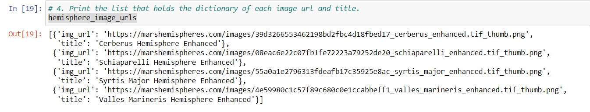
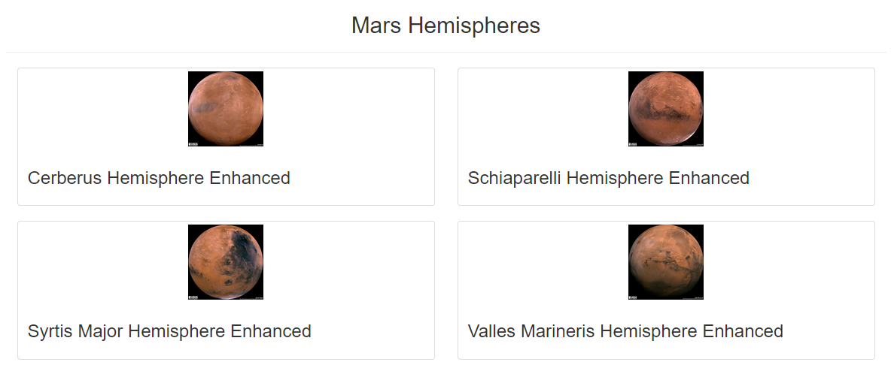
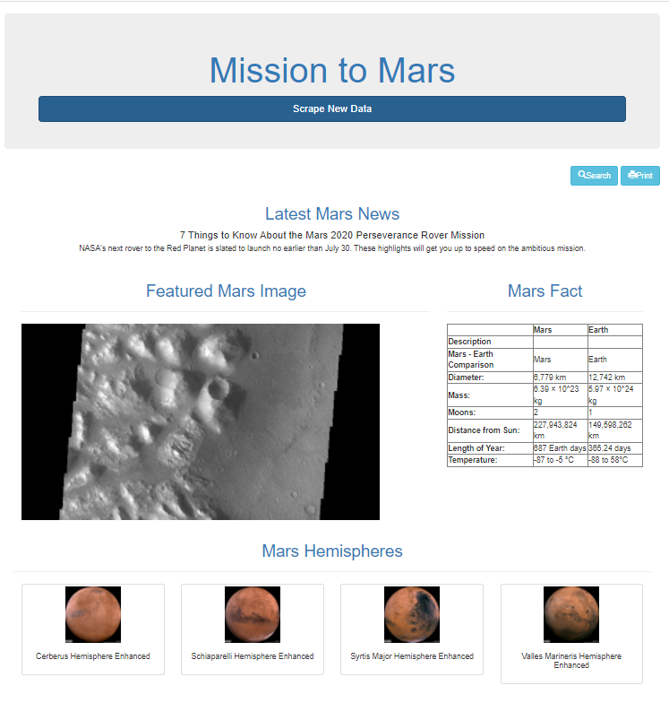

# Mission-to-Mars

## Overview of Project:
using the latest technologies to utilize the existing web pages to scrap the only information we needed was a wonderful experience.
Using BeautifulSoup and Splinter, it was only a few lines of code, and the automated scraping could run for a long time.

## Summary:
Although overall it overwhelming experience in such a short time, going over the basics of Bootstrapping, CSS, and Flask using python, to scrap the web pages, was an incredible experience. 
- Hemisphere Scraping Data

- Image URL retrieval

- Result screen

## Challenges:  This project was much more like deep your toes to the river. We went through so many experiences in so little time.  However, learning the basics of it fulfilled only the curiosity side of it.  Much more to experience.  We will wait and see.
- Bootstrap & Glyphicons - Limitless functionalities and over a dozen reusable components, only learned to get to a couple.
- BeautifulSoup & Splinter - Few lines of code automated full process scraping the web pages.
- CSS - Different page needs different format & only learn the necessary portion of it.
- MongoDB - It was good to experience simple command line calls, but I am sure there is so much more to learn.
- Flask - Scraping was fun, but again there is so much more to learn.
